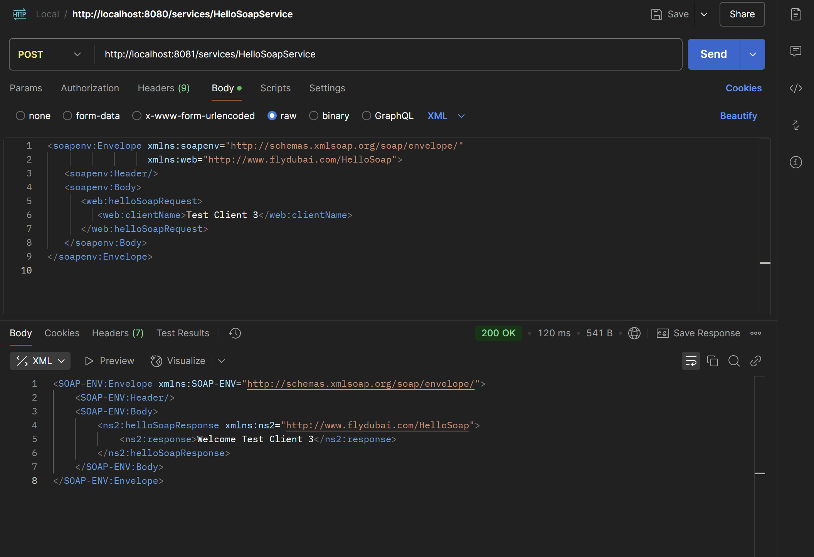
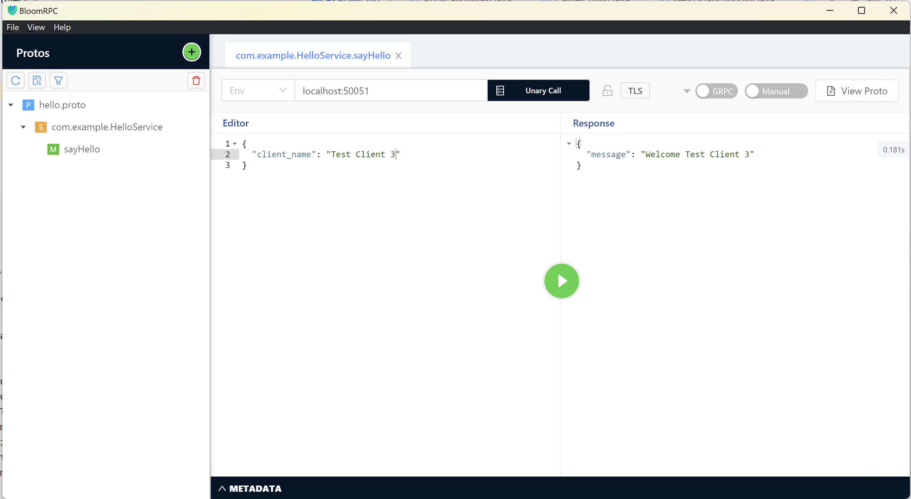

# TEST

1. THe modules are not named or organized properly due to shortage of time.
2. demo --> Which has SOAP web service running using apache camel.
3. grpc-soap-proxy --> Is a quarkus application exposing GRPC internally makes calls to demo service 
               since it is a basic application using  SOAPConnection, SOAPBody. 
4. There is a better approach is using WSDL and generating resources and calling the service based on the WSDL.

ScreenShots of the result:

The Above Image where directly accessing the SOAP service through postman.

The Above Image where the SOAP service is contacted through GRPC.